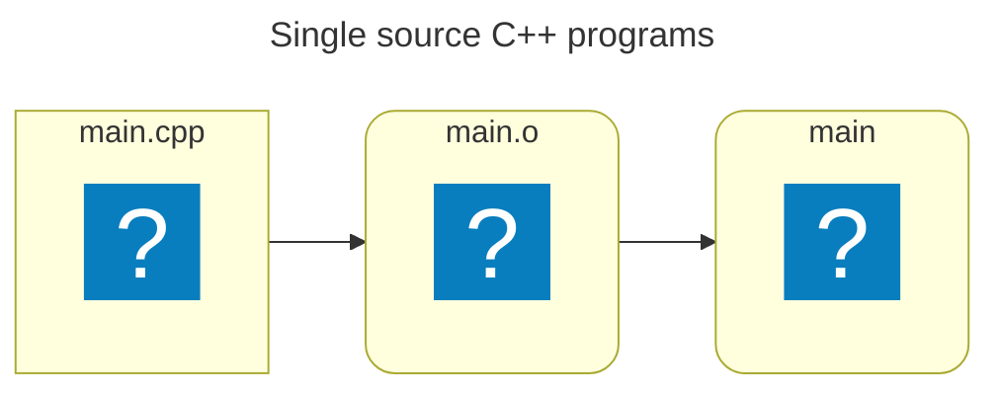
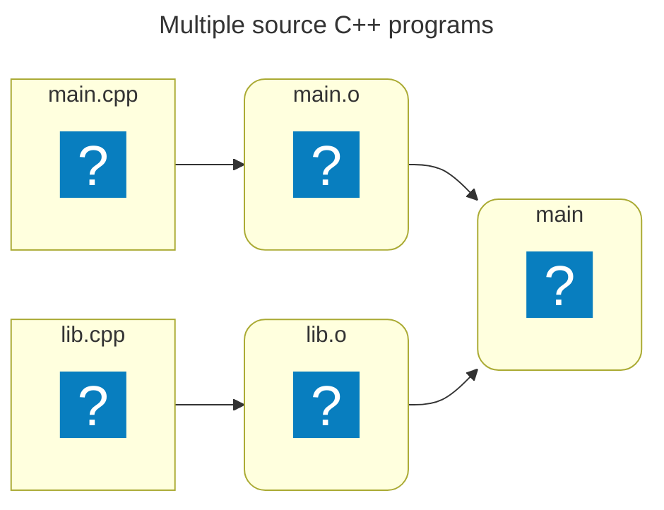
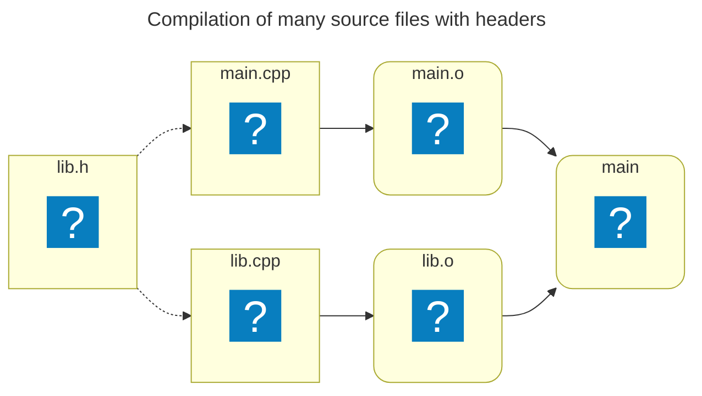
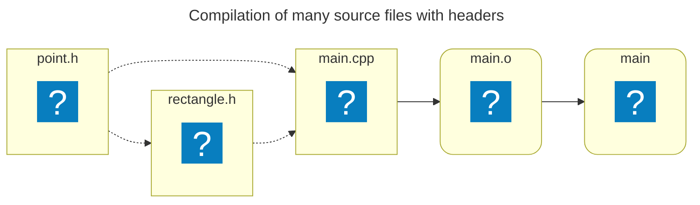

# Why Modules?

---
layout: statement
---

## Let's step back

---
layout: fact
title: Code for single source C++ programs
---

<div class="px-[25%] text-left">

```cpp [main.cpp ~i-vscode-icons:file-type-cpp~]
int foo(const int x)
{
    return x - 42;
}

int main()
{
    return foo(42);
}
```

</div>

---
layout: fact
title: Flowchart of single source C++ programs
---



<div class="px-[25%]">

```sh {*}{lines: false}
g++ -c main.cpp
g++ main.o -o main
```

</div>

---
layout: default
title: Code for single source C++ programs
---

<div class="inset-5 grid grid-cols-2 gap-x-4 items-center absolute">

````md magic-move[main.cpp ~i-vscode-icons:file-type-cpp~]{at: 1}

```cpp
int foo(const int x)
{
    return x - 42;
}

int main()
{
    return foo(42);
}
```

```cpp {*|3}
int main()
{
    return foo(42);
}
```

```cpp {*|*}
int foo(const int x);

int main()
{
    return foo(42);
}
```

````

<v-click>

````md magic-move[lib.cpp ~i-vscode-icons:file-type-cpp~]{at: 1}

```cpp
ㅤ 
```

```cpp {*|none|*}
int foo(const int x)
{
    return x - 42;
}
```

```cpp
int foo(const int x);

int foo(const int x)
{
    return x - 42;
}
```

````

</v-click>

</div>

<div class="fixed inset-x-[32%] bottom-25 text-center">
```txt {hide|*|hide}{at: 2, lines: false}
error: ‘foo’ was not declared in this scope
```
</div>

<!-- ### Notes:
* `warning: no previous prototype for function 'helloWorld' [-Wmissing-prototypes]`
-->

---
layout: fact
title: Flowchart of multiple source C++ programs
---



<div class="px-[25%]">

```sh {*}{lines: false}
g++ lib.cpp -c
g++ main.cpp -c
g++ main.o lib.o -o main
```

</div>

---
layout: default
info: |
    Information sourced from [Microsoft Learn](https://learn.microsoft.com/en-us/cpp/cpp/header-files-cpp?view=msvc-170)
---

## Multiple source C++ programs

<br>

* Source files &rarr; Translation Units (TUs)
* Each name is declared in every TU it is used
* Linker finds suitable definitions
* Inconsistencies will cause errors or unintended behavior

---
layout: default
title: Introducing headers
---

<br>

```cpp [lib.h ~i-vscode-icons:file-type-cheader~]{hide|*}{at: 4}
int foo(const int x);
```

````md magic-move[lib.cpp ~i-vscode-icons:file-type-cpp~]{at: 1}

```cpp
int foo(const int x);

int foo(const int x)
{
    return x - 42;
}
```

```cpp {*|3-6}
int foo(const int x, const int y = 42);

int foo(const int x, const int y)
{
    return x - y;
}
```

```cpp {1|1}
int foo(const int x);

int foo(const int x)
{
    return x - 42;
}
```

```cpp {1|*}
#include "lib.h"

int foo(const int x)
{
    return x - 42;
}
```

````

````md magic-move[main.cpp ~i-vscode-icons:file-type-cpp~]{at: 1}

```cpp {*|none|1|1|1}
int foo(const int x);

int main()
{
    return foo(42);
}
```

```cpp {1|*}
#include "lib.h"

int main()
{
    return foo(42);
}
```

````

```txt []{hide|*|hide}{at: 2, lines: false}
error LNK2019: unresolved external symbol "int __cdecl foo(int)" referenced in function main
```

---
layout: fact
title: Flowchart of compilation of many source files with headers
---



<div px-50>

```sh {lines: false}
g++ lib.cpp -c
g++ main.cpp -c
g++ main.o lib.o -o main
```

</div>

---
layout: default
info: |
  https://en.cppreference.com/w/cpp/language/definition.html
---

## One Definition Rule (ODR)

<br>

<ul>
  <li>Each name must be declared in every TU it is used</li>
  <li v-click>Any entity defined exactly once
    <ul>
    <li v-click="2"><span v-mark.red=2>Only one</span> definition is allowed in any one TU</li>
    </ul>
  </li>
  
</ul>

---
layout: quote
info: |
    https://www.open-std.org/jtc1/sc22/wg21/docs/papers/2016/p0142r0.pdf
---

## "Every word in the C and C++ definitions about 'ODR' are there to work around the fact that we cannot identity the one true definition and have to compare definitions instead"

- Bjarne Stroustrup (qtd. in Dos Reis, Hall, and Nishanov)


---
layout: fact
title: Compilation of many source files with two headers
---



---
layout: default
title: Introduction for avoiding multiple definitions through headers
---

<div class="grid grid-cols-2 gap-x-4 items-center">

```cpp [point.h ~i-vscode-icons:file-type-cheader~]{*|none|*|none|none|*|none|hide}{at: 1}
struct Point
{
    int x, y;
};
```

```cpp [rectangle.h ~i-vscode-icons:file-type-cheader~]{hide|*|1|3-6|none|*|none|hide}{at: 1}
#include "point.h"

struct Rectangle
{
    Point topLeft, bottomRight;
};
```

</div>

```cpp [main.cpp ~i-vscode-icons:file-type-cpp~]{hide|*|1-2|6-7|*}{at: 4}
#include "point.h"
#include "rectangle.h"

int main()
{
    const Point p1{1, 2}, p2{2, 4};
    const Rectangle r{p1, p2};
}
```

---
layout: default
title: Pre-processing a TU
clicks: 6
---

````md magic-move[main.cpp ~i-vscode-icons:file-type-cpp~]{at: 1}

```cpp {*|2}
#include "point.h"
#include "rectangle.h"

int main()
{
    const Point p1{1, 2}, p2{2, 4};
    const Rectangle r{p1, p2};
}
```

```cpp {*|1-2}
#include "point.h"
#include "point.h"

struct Rectangle
{
    Point topLeft, bottomRight;
};

int main()
{
    const Point p1{1, 2}, p2{2, 4};
    const Rectangle r{p1, p2};
}
```

```cpp {*|*|1-8}
struct Point
{
    int x, y;
};
struct Point
{
    int x, y;
};

struct Rectangle
{
    Point topLeft, bottomRight;
};

int main()
{
    const Point p1{1, 2}, p2{2, 4};
    const Rectangle r{p1, p2};
}
```

````

<div v-click.hide=4>

Pre-processing `main.cpp`...

</div>

<div v-click="[5, 7]">

Compiling `main.cpp`... <span v-click=6>`point.h:1:8: error: redefinition of 'struct Point'`</span>

</div>

---
layout: default
title: Tools for avoiding multiple definitions through headers
---

<div class="grid grid-cols-2 gap-x-4 items-center">

````md magic-move[point.h ~i-vscode-icons:file-type-cheader~]{at: 1}

```cpp
struct Point
{
    int x, y;
};
```

```cpp {1-2,7}
#ifndef POINT_H
#define POINT_H
struct Point
{
    int x, y;
};
#endif
```

```cpp {1}
#pragma once

struct Point
{
    int x, y;
};
```

````

````md magic-move[rectangle.h ~i-vscode-icons:file-type-cheader~]{at: 1}

```cpp
#include "point.h"

struct Rectangle
{
    Point topLeft, bottomRight;
};
```

```cpp {1-2,9}
#ifndef RECTANGLE_H
#define RECTANGLE_H
#include "point.h"

struct Rectangle
{
    Point topLeft, bottomRight;
};
#endif
```

```cpp {1}
#pragma once

#include "point.h"

struct Rectangle
{
    Point topLeft, bottomRight;
};
```

````

</div>

```cpp [main.cpp ~i-vscode-icons:file-type-cpp~]{none}
#include "point.h"
#include "rectangle.h"

int main()
{
    const Point p1{1, 2}, p2{2, 4};
    const Rectangle r{p1, p2};
}
```

---
layout: default
title: Pragma once has a catch
---

Let's pretend...

<v-click>

* `point.h` is now the de-facto point header!

</v-click>

```txt {hide|all|3-4,8-9|1,6|*}{lines: false}
main.cpp
third_party/
├─ pointlib/
│  ├─ point.h
├─ mathlib/
│  ├─ mathlib.h
│  ├─ third_party/
│  │  ├─ pointlib/
│  │  │  ├─ point.h
```

<div class="grid grid-cols-2 gap-x-3 items-center">

<!-- Snippet from @/testing/pragma_once_gotcha/main.cpp -->
```cpp [main.cpp ~i-vscode-icons:file-type-cpp~]{hide|*}{at: 4}
#include "third_party/mathlib/mathlib.h"
#include "third_party/pointlib/point.h"
```

<!-- Snippet from @/testing/pragma_once_gotcha/third_party/mathlib/mathlib.h -->
```cpp [mathlib.h ~i-vscode-icons:file-type-cheader~]{hide|*}{at: 4}
#pragma once
#include "third_party/pointlib/point.h"
```

</div>

<v-click at=5>

<!-- Microsoft (R) C/C++ Optimizing Compiler Version 19.44.35213 for x64 -->
Compiling... <span v-click=6>Surprise! `pointlib/point.h(3): error C2011: 'Point': 'struct' type redefinition`</span>

</v-click>

---
layout: default
info: |
    https://docwiki.embarcadero.com/RADStudio/Athens/en/Pragma_once
---

## Avoiding multiple definitions through headers

Some considerations:

<v-clicks>

* `#pragma once`
    * Not standard, but widely supported
    * Compilers use heuristics:
        * File size
        * Modification time
        * File content
* Header guards
    * Compilers optimize invoking the preprocessor

</v-clicks>

<!-- https://docwiki.embarcadero.com/RADStudio/Athens/en/Pragma_once#:~:text=%23pragma%20once%20is%20a%20preprocessor,times%20in%20the%20current%20project. -->
<!-- Note: The same thing can be achieved with #ifndef/#define/#endif, which is the ANSI standard way of dealing with the double inclusion problem. -->

---
layout: quote
info:
    https://www.open-std.org/jtc1/sc22/wg21/docs/papers/2021/p2412r0.pdf
---

## "Header files are a major source of complexity, errors caused by dependencies, and slow compilation"
- Bjarne Stroustrup

---
layout: default
info: |
    https://learn.microsoft.com/en-us/cpp/cpp/header-files-cpp?view=msvc-170#what-to-put-in-a-header-file
---

## What shouldn't be in a header?

According to [Microsoft Learn](https://learn.microsoft.com/en-us/cpp/cpp/header-files-cpp?view=msvc-170#what-to-put-in-a-header-file):

* Built-in type definitions at namespace or global scope
* Non-inline function definitions
* Non-const variable definitions
* Aggregate definitions
* Unnamed namespaces
* Using directives

---
layout: default
---

### Built-in type definitions at namespace or global scope

Aliasing built in types isn't allowed:

```cpp [header.h ~i-vscode-icons:file-type-cheader~]
#pragma once

struct MyInt{ ... };

using int = MyInt; // error: expected unqualified-id

typedef MyInt int; // error: multiple types in one declaration
```

---
layout: default
---

### Built-in type definitions at namespace or global scope

`define` directives are bad practices in headers:

```cpp [header.h ~i-vscode-icons:file-type-cheader~]{*|5}{at: 1}
#pragma once

#include <cstdint>

#define int int64_t
```

```cpp [main.cpp ~i-vscode-icons:file-type-cpp~]{*|3}{at: 1}
#include "header.h"

int main()
{
   return 0;
}
```

```txt {hide|*}{at: 1, lines: false}
error: 'main' must return 'int'
```

---
layout: default
---

### Built-in type definitions at namespace or global scope

Aliases can produce unexpected behavior:

```cpp [header.h ~i-vscode-icons:file-type-cheader~]{*|3-4|6|none|none|6}{at: 1}
#pragma once

using UserId = int;
using ProductId = int;

void process(UserId user, ProductId product);
```

```cpp [main.cpp ~i-vscode-icons:file-type-cpp~]{hide|*|5-6|5-7}{at: 3}
#include "header.h"

int main()
{
    ProductId product = 42;
    UserId user = 24;
    process(product, user);
}
```

---
layout: default
---

### Non-inline function definitions

<br>

<div class="grid grid-cols-2 gap-x-4 items-center">

<div>

````md magic-move[lib.h ~i-vscode-icons:file-type-cheader~]{at: 1}

```cpp {*|3|5|7|none|*|7|none|*|none|*|*|*|*|*}
#pragma once

struct Point {...};

void printPoint(const Point& point) { ... }

Point addPoints(const Point& p1, const Point& p2);
```

```cpp {5}
#pragma once

struct Point {...};

inline void printPoint(const Point& point) { ... }

Point addPoints(const Point& p1, const Point& p2);
```

```cpp {5}
#pragma once

struct Point {...};

void printPoint(const Point& point);

Point addPoints(const Point& p1, const Point& p2);
```

````

<v-click at=4>

````md magic-move [lib.cpp ~i-vscode-icons:file-type-cpp~]{at: 5}

```cpp {*|1|3-6|none|none|none|*|*|*|*|*|none}
#include "lib.h"

Point addPoints(const Point& p1, const Point& p2)
{
    ...
}
```

```cpp {3-6}
#include "lib.h"

void printPoint(const Point& point)
{
    ...
}

Point addPoints(const Point& p1, const Point& p2)
{
    ...
}
```

````

</v-click>

</div>

```cpp [main.cpp ~i-vscode-icons:file-type-cpp~]{hide|*|1|5-6|*|*|*|*|*|none}{at: 7}
#include "lib.h"

int main()
{
    Point p = addPoints({1, 2}, {3, 4});
    printPoint(p);
}
```

</div>

<div v-click="[10, 14]">

Compiling... <span v-click=11><solar-check-circle-bold/></span>

</div>

<div v-click="[12, 14]">

Linking... <span v-click=13>`ld: multiple definition of 'printPoint(Point const&)'`</span>

</div>

---
layout: default
---

### Non-const variable definitions

<br>

```cpp [lib.h ~i-vscode-icons:file-type-cheader~]
#pragma once

int variable = 0;
```

<v-click>

```txt {lines:false}
ld: main.o:(.bss+0x0): multiple definition of `variable'; lib.o:(.bss+0x0): first defined here
```

</v-click>

<v-clicks>

* Every TU that includes this header gets its own copy of the variable
* ODR violation

</v-clicks>

---
layout: default
---

### Aggregate definitions

<br>

```cpp [lib.h ~i-vscode-icons:file-type-cheader~]
#pragma once

int aggregate[] = {10, 20, 30};
```

<v-click>

```txt {lines:false}
ld: main.o:(.bss+0x0): multiple definition of `aggregate'; lib.o:(.bss+0x0): first defined here
```

</v-click>

<v-clicks>

* Every TU that includes this header gets its own copy of the variable
* ODR violation

</v-clicks>

<!-- ### Notes:

In C++, an aggregate is a specific type of data structure that can be initialized using a special syntax called aggregate initialization.
The definition of an aggregate is quite strict and has evolved slightly across C++ standards.
According to the C++ standard, an aggregate is:
* An array: Any C-style array is considered an aggregate.

* A class type (struct, class, or union) that meets the following criteria:
    * No user-declared constructors: It must not have any constructors explicitly defined by the user. Implicitly declared default or copy constructors are allowed.
    * No private or protected non-static data members: All non-static data members must be public.
    * No base classes: It cannot inherit from any other class.
    * No virtual functions: It cannot have any virtual functions.
    * No in-class initializers for non-static data members (pre-C++11): This restriction was lifted in C++11, allowing in-class initializers for non-static data members in aggregates.

In essence, an aggregate class type in C++ is a simple data container, similar to a C-style struct, designed for straightforward initialization without complex construction logic.
This simplicity allows for aggregate initialization, where members can be initialized directly using a braced-initializer list, similar to how arrays are initialized.
-->

---
layout: default
---

### Unnamed namespaces

<br>

```cpp [lib.h ~i-vscode-icons:file-type-cheader~]
#pragma once

namespace
{
    void doSomething() { ... }
}
```

<v-clicks>

* Common copy-paste mistake when moving from a `.cpp` file
* Every TU that includes this header gets its own copy of the function definition
* Binary bloat!

</v-clicks>

---
layout: default
---

### Using directives

<br>

```cpp [header.h ~i-vscode-icons:file-type-cheader~]
#pragma once

using namespace std;
```

<v-clicks>

* This pollutes the global namespace
* Every transitive header becomes problematic
* Increases the chance of name collisions

</v-clicks>

---
layout: statement
---

## Modules: A novel approach to code organization in C++

---
layout: quote
---

### A strong statement from [Microsoft Learn](https://learn.microsoft.com/en-us/cpp/cpp/header-files-cpp?view=msvc-170):

<br>

> <solar-notebook-linear/> Note:
> In Visual Studio 2019, the C++20 modules feature is introduced as an improvement and eventual replacement for header files.
