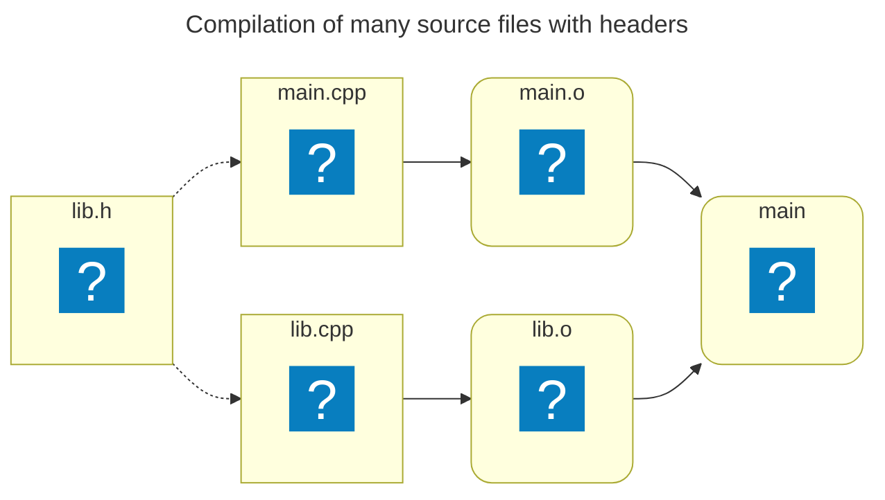
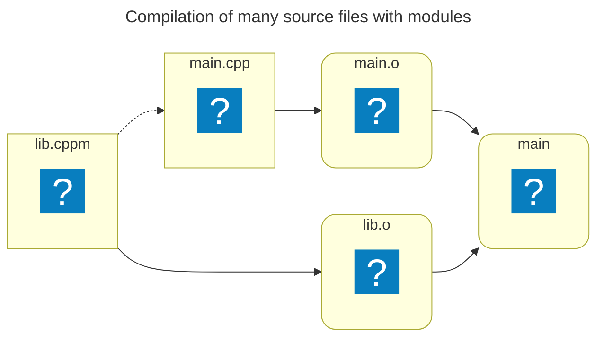
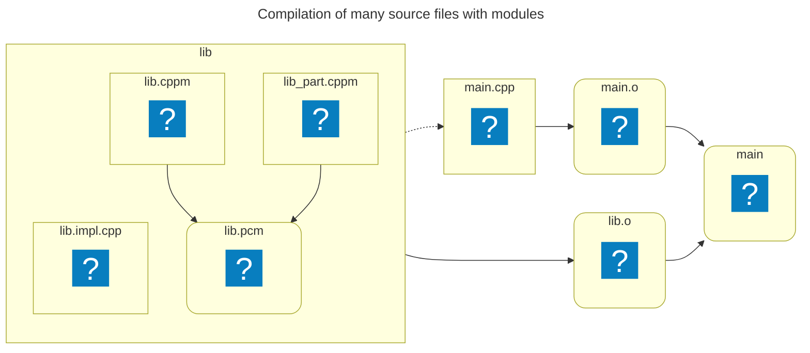

# What Are C++ Modules?

---
layout: default
info: |
    Information sourced from https://clang.llvm.org/docs/StandardCPlusPlusModules.html
---

## Disambiguiation

The term `module` can be ambiguous:

<v-clicks depth=2>

* Clang Header Module
* Objective-C Module
* Standard C++ Module
    - <span v-mark.red=6>Named Modules</span>
    - Header Units

</v-clicks>

---
layout: default
info: |
    https://www.open-std.org/jtc1/sc22/wg21/docs/papers/2012/n3347.pdf
    https://www.open-std.org/jtc1/sc22/wg21/docs/papers/2016/p0142r0.pdf
---

## Modules in C++

Modern tool for consuming external code:

- Packages components and encapsulate their implementations
- Reduces opportunities for violations of the ODR
- Designed to co-exist but minimize reliance on the preprocessor

<v-click>

Fundamental goals:

- Componentization
- Isolation from macros
- Scalable build
- Support for modern semantics-aware developer tools
- Reduce opportunities for violating the ODR

</v-click>

<!-- ### Notes:
- Componentialization: Clearly separate interfaces from implementations
- Isolation from macros: Provides a strict boundary that macros cannot cross
- Scalable build: Avoid redundant re-parsing of headers
- Support for modern semantics-aware developer tools: Well-structured, machine-readable representation of program entities
-->

---
layout: fact
title: Compilation of many source files with headers
---



---
layout: fact
title: Conceptual compilation of many source files with modules
---



---
layout: default
---

## Modules in C++

<div class="fixed inset-5 grid grid-cols-2 gap-x-4 items-center">

<div>

```cpp [lib.h ~i-vscode-icons:file-type-cheader~]{*|3-6|8|none|*|8|none}{at: 1}
#pragma once

struct Point
{
    int x, y;
};

Point addPoints(Point const& a, Point const& b);
```

```cpp [lib.cpp ~i-vscode-icons:file-type-cpp~]{hide|*|1|3-6|none}{at: 3}
#include "lib.h"

Point addPoints(Point const& a, Point const& b)
{
    return { a.x + b.x, a.y + b.y};
}
```

</div>

```cpp [lib.cppm ~i-vscode-icons:file-type-cpp2~]{hide|*|1|3-6|8-11}{at: 6}
export module lib;

export struct Point
{
    int x, y;
};

export Point addPoints(Point const& a, Point const& b)
{
    return { a.x + b.x, a.y + b.y};
}
```

</div>

---
layout: default
info: |
    Information sourced from https://clang.llvm.org/docs/StandardCPlusPlusModules.html#module-and-module-unit
---

## An overview of module units

Every module consists of one or more Module Units (MUs)

<v-click>

* A module unit (typically) starts with a module declaration:
  ```cpp {*}{lines: false}
  [export] module module_name[:partition_name];
  ```

</v-click>

<br>

<v-clicks>

* MU is a special kind of TU
* MUs aren't exposed outside the module
* A MU is either an interface or implementation unit
* Modules can be broken down into partitions

</v-clicks>

<v-click>

<br>
<hr>
<br>

All MUs are compiled, generating a Built Module Interface (BMI)

</v-click>

---
layout: default
info: |
    https://stackoverflow.com/questions/70818433/the-orthogonality-of-module-interface-implementation-units-and-partitions
    https://timsong-cpp.github.io/cppwp/n4861/module.unit
---

## Interface and implementation units

* Interface units have an `export`-ed module declaration

```cpp [example.cppm ~i-vscode-icons:file-type-cpp2~]{*|1|none}{at: 1}
export module myModule;

export int foo();
```

```cpp [example.impl.cpp ~i-vscode-icons:file-type-cpp2~]{*|none|1}{at: 1}
module myModule;

int foo() { return 42; }
```

---
layout: default
info: |
    https://www.open-std.org/jtc1/sc22/wg21/docs/papers/2019/p1103r3.pdf
---

## Module partitions

* Partitions allow splitting the interface and/or implementation

```cpp [geometry.cppm ~i-vscode-icons:file-type-cpp2~]{*|1|none|none|none|3}{at: 1}
export module geometry;

export import :circle;
```

```cpp [geometry-circle.cppm ~i-vscode-icons:file-type-cpp2~]{*|none|1|none|3|none}{at: 1}
export module geometry:circle;

import :helpers;

// ...
```

```cpp [geometry-helpers.cppm ~i-vscode-icons:file-type-cpp2~]{*|none|none|1|none}{at: 1}
module geometry:helpers;

// ...
```


---
layout: fact
title: Compilation of many source files with modules
---



<!-- ### Notes:
- This slide uses clang terminology
-->

---
layout: default
info: |
    Information sourced from https://clang.llvm.org/docs/StandardCPlusPlusModules.html#module-and-module-unit
    https://www.open-std.org/jtc1/sc22/wg21/docs/papers/2019/p1103r3.pdf
---

## An overview of module units

Module units can be classified as:

* Primary module interface unit
* Module implementation unit
* Module partition interface unit
* Internal module partition unit

---
layout: default
info: |
    https://www.open-std.org/jtc1/sc22/wg21/docs/papers/2019/p1103r3.pdf
---

### Primary module interface unit

Interface module units without a partition:

```cpp {*}{lines: false}
export module module_name;
```

<br>

<v-clicks>

* Every module must contain exactly one of these

</v-clicks>

---
layout: default
---

### Module implementation unit

Implementation module units without a partition:

```cpp {*}{lines: false}
module module_name;
```

<br>

<v-clicks>

* Useful for splitting interface / implementation
* Implicitly performs `import module_name;`

</v-clicks>

---
layout: default
---

### Module partition interface unit

Interface module units with a partition:

```cpp {*}{lines: false}
export module module_name:partition_name;
```

<br>

<v-clicks>

* Tool for separating large interfaces into multiple files
* Must be (transitively) exported by the primary module interface unit:
  ```cpp {*}{lines: false}
  export module module_name;

  export import :partition_name;
  ```

</v-clicks>

---
layout: default
---

### Internal module partition unit

Implementation module units with a partition:

```cpp {*}{lines: false}
module module_name:partition_name;
```

<br>

<v-clicks>

* Useful for utility functions
* Not part of the external interface of its module

</v-clicks>

---
layout: default
info: |
    https://en.cppreference.com/w/cpp/language/modules.html#Private_module_fragment
---

## Private module fragment

Facilitates tidy interfaces:

````md magic-move [module.cppm ~i-vscode-icons:file-type-cpp2~]

```cpp
export module myModule;

export void foo() { ... }

void helper() { ... }

export void bar() { helper(); ... }
```

```cpp {9}
export module myModule;

export void foo() { ... }

void helper() { ... }

export void bar() { helper(); ... }

module : private;
```

```cpp {6-12|1-4}
export module myModule;

export void foo();
export void bar();

module : private;

void foo() { ... }

void helper() { ... }

void bar() { helper(); ... }
```

````

<v-clicks>

* Can only be in the `Primary module interface unit`
* Only for modules with a single MU

</v-clicks>

<!-- ### Notes:
* Especially useful for specifying things that don't trigger re-compilation
* Entities in the private module fragment are local to this module unit's TU
-->

---
layout: default
info: |
    https://en.cppreference.com/w/cpp/language/modules.html
    https://www.open-std.org/jtc1/sc22/wg21/docs/papers/2019/p1103r3.pdf
---

## Global module fragment

Preprocessor usage in modules:

````md magic-move[module.cppm ~i-vscode-icons:file-type-cpp2~]

```cpp {*|1-4}
export module myModule;

#include <vector>
#include <print>

export void printSize(std::vector<int> const &vec)
{
    std::println("Size: {}", vec.size());
}
```

```cpp {1-6|*}
module;

#include <vector>
#include <iostream>

export module myModule;

export void printSize(std::vector<int> const &vec)
{
    std::println("Size: {}", vec.size());
}
```

````

<v-clicks>

* Non-referenced entities are discarded
* Useful when it is not possible to import the headers

</v-clicks>

```txt {hide|*|hide}{at: 1, lines: false}
warning C5244: '#include <vector>' in the purview of module 'm' appears erroneous.
Consider moving that directive before the module declaration
```

<!--
* Especially useful when the header uses preprocessing macros as configuration
-->

---
layout: default
info: |
    https://timsong-cpp.github.io/cppwp/n4861/module.import
---

## Header Units

Allows importing headers:

```cpp {*}{lines: false}
import "header.h";
```

<br>

<v-click at=1>

- Translation unit formed by synthesizing an <span v-mark.red=2>importable header</span>

</v-click>

<v-clicks at=3>

- All declarations are implicitly exported
- Provides module benefits for legacy headers

</v-clicks>

<!-- ### Notes:
- `importable header` is an implementation-defined concept!
- Main benefits over using headers normally: Encapsulation + build speed
-->

---
layout: default
info: |
    https://timsong-cpp.github.io/cppwp/n4861/module.import
---

## Header Units

No external definitions:

````md magic-move [foo_legacy.h ~i-vscode-icons:file-type-cheader~]{at: 2}

```cpp 
#pragma once

void foo() { ... }
```

```cpp 
#pragma once

inline void foo() { ... }
```

````

```txt {hide|*|hide}{at: 1, lines: false}
error: non-inline external definitions are not permitted in C++ header units
```

---
layout: default
---

## Header Units

Macros are made visible:

```cpp [foo_legacy.h ~i-vscode-icons:file-type-cheader~]{*|3-4|none|3|3-4}{at: 1}
#pragma once

#define FOO_VERSION 42
inline void foo() { ... }
```

```cpp [foo.cppm ~i-vscode-icons:file-type-cpp2~]{*|none|3|5-8|3}{at: 1}
export module foo;

export import "foo_legacy.h";

export bool check_version(int const version)
{
    return version == FOO_VERSION;
}
```

<v-click at=5>

* Macros are not re-exported

</v-click>

---
layout: default
---

### STL header units

[C++20](https://en.cppreference.com/w/cpp/standard_library.html) defines _importable C++ library headers_

<v-click>

````md magic-move[main.cpp ~i-vscode-icons:file-type-cpp~]

```cpp
#include <iostream>
#include <map>
#include <vector>
#include <algorithm>
#include <chrono>
#include <random>
#include <memory>
#include <cmath>
#include <thread>
```

```cpp
import <iostream>;
import <map>;
import <vector>;
import <algorithm>;
import <chrono>;
import <random>;
import <memory>;
import <cmath>;
import <thread>;
```

````

</v-click>

---
layout: default
---

## STL module

[C++23](https://en.cppreference.com/w/cpp/standard_library.html) exposes the STL as modules

<v-click>

````md magic-move[main.cpp ~i-vscode-icons:file-type-cpp~]

```cpp
#include <iostream>
#include <map>
#include <vector>
#include <algorithm>
#include <chrono>
#include <random>
#include <memory>
#include <cmath>
#include <thread>
```

```cpp
import std;
```

````

</v-click>

<v-clicks>

- `std` exposes all symbols in the `std` namespace
- `std.compat` additionally exposes C global namespace declarations
  - e.g. `::printf` from `<cstdio>`
- Macros are not exposed
  - e.g. `assert` from `<cassert>`

</v-clicks>
