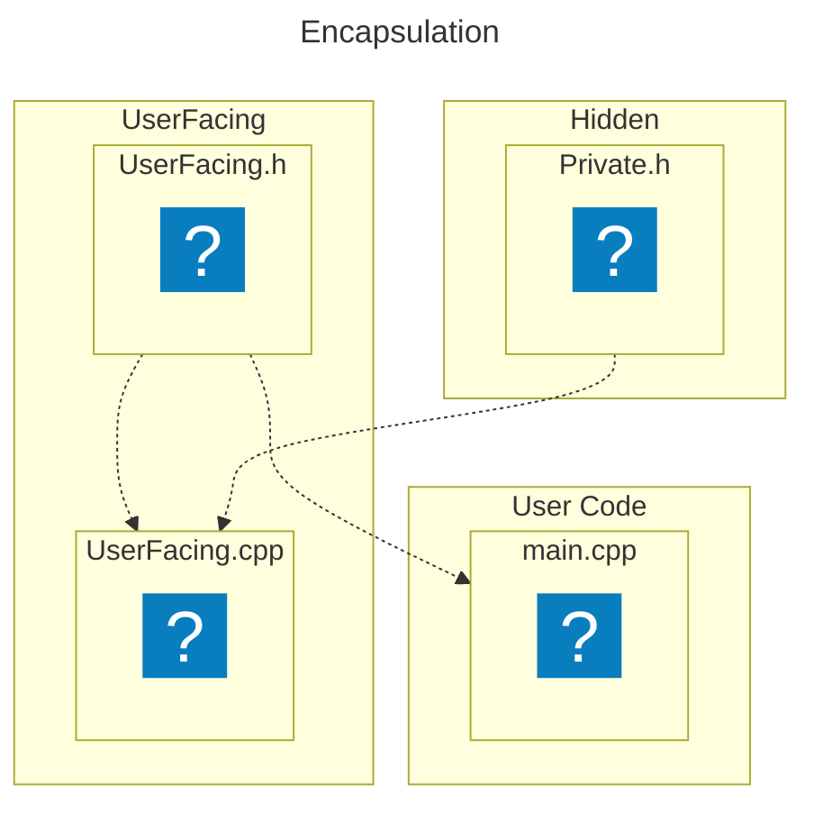
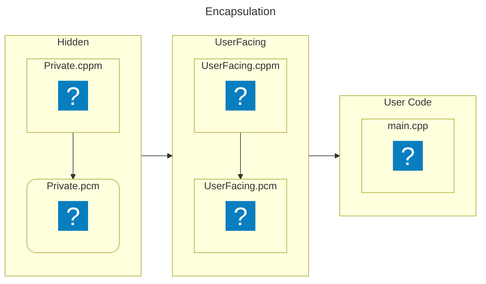
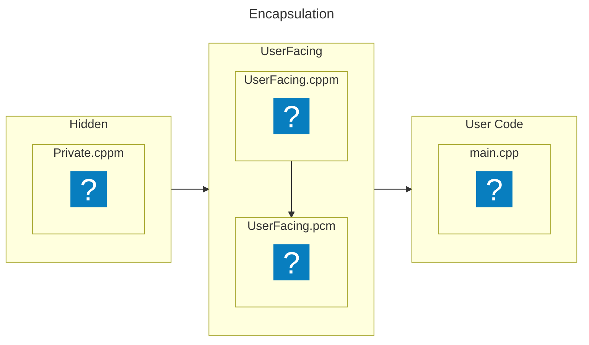

# Traditional Headers vs. Modules

---
layout: statement
---

## Let's circle back to headers

<!-- ### Notes:
* Specifically, the problems with headers, and how modules can help solve that
-->

---
layout: default
---

## Dependency completeness

<div class="grid grid-cols-2 gap-x-4 items-center">

```cpp [point.h ~i-vscode-icons:file-type-cheader~]
#pragma once

struct Point
{
    int x, y;
};
```

```cpp [rectangle.h ~i-vscode-icons:file-type-cheader~]
#pragma once

#include "point.h"

struct Rectangle
{
    Point topLeft, bottomRight;
};
```

</div>

```cpp[main.cpp ~i-vscode-icons:file-type-cpp~]
#include "point.h"
#include "rectangle.h"

int main()
{
    const Point p1{1, 2}, p2{2, 4};
    const Rectangle r{p1, p2};
}
```

---
layout: default
---

## Dependency completeness

<div class="grid grid-cols-2 gap-x-4 items-center">

```cpp [point.cppm ~i-vscode-icons:file-type-cpp2~]
export module point;

export struct Point
{
    int x, y;
};
```

```cpp [rectangle.cppm ~i-vscode-icons:file-type-cpp2~]
export module rectangle;

export import point;

export struct Rectangle
{
    Point topLeft, bottomRight;
};
```

</div>

```cpp[main.cpp ~i-vscode-icons:file-type-cpp~]
import point;
import rectangle;

int main()
{
    const Point p1{1, 2}, p2{2, 4};
    const Rectangle r{p1, p2};
}
```

---
layout: default
---

## Built-in type definitions at namespace or global scope

```cpp [header.h ~i-vscode-icons:file-type-cheader~]
#pragma once

#include <cstdint>

#define int int64_t
```

```cpp [main.cpp ~i-vscode-icons:file-type-cpp~]
#include "header.h"

int main() // error: 'main' must return 'int'
{
   return 0;
}
```

---
layout: default
---

## Built-in type definitions at namespace or global scope

```cpp [module.cppm ~i-vscode-icons:file-type-cpp2~]
module;

#define int int64_t

export module myModule;
```

```cpp [main.cpp ~i-vscode-icons:file-type-cpp~]
import myModule;

int main()
{
   return 0;
}
```

---
layout: default
---

### Non-inline function definitions

<br>

```cpp [header.h ~i-vscode-icons:file-type-cheader~]
#pragma once

void doSomething()
{
    ...
}
```

---
layout: default
---

### Non-inline function definitions

<br>

```cpp [module.cppm ~i-vscode-icons:file-type-cpp2~]
export module myModule;

export void doSomething()
{
    ...
}
```

---
layout: default
---

### Non-const variable definitions

```cpp [header.h ~i-vscode-icons:file-type-cheader~]
#pragma once

int variable = 0;
```

---
layout: default
---

### Non-const variable definitions

```cpp [module.cppm ~i-vscode-icons:file-type-cpp2~]
export module myModule;

export int variable = 0;
```

---
layout: default
---

### Aggregate definitions

<br>

```cpp [header.h ~i-vscode-icons:file-type-cheader~]
#pragma once

int aggregate[] = {10, 20, 30};
```

---
layout: default
---

### Aggregate definitions

<br>

```cpp [module.cppm ~i-vscode-icons:file-type-cpp2~]
export module myModule;

export int aggregate[] = {10, 20, 30};
```

---
layout: default
---

### Unnamed namespaces

<br>

```cpp [header.h ~i-vscode-icons:file-type-cheader~]
#pragma once

namespace
{
    void doSomething() { ... }
}
```

---
layout: default
---

### Unnamed namespaces

<br>

````md magic-move[module.cppm ~i-vscode-icons:file-type-cpp2~]

```cpp
export module myModule;

namespace
{
    void doSomething() { ... }
}
```

```cpp
export module myModule;

namespace
{
    export void doSomething() { ... }
}
```

````

```txt {hide|hide|*}{at: 1, lines: false}
error C2294: cannot export symbol '`anonymous-namespace'::doSomething' because it has internal linkage
```

---
layout: default
---

### Using directives

<br>

```cpp [header.h ~i-vscode-icons:file-type-cheader~]
#pragma once

using namespace std;
```

---
layout: default
---

### Using directives

<br>

```cpp [module.cppm ~i-vscode-icons:file-type-cpp2~]
export module myModule;

using namespace std;
```

---
layout: fact
title: Encapsulation flowchart
---



---
layout: default
---

## Encapsulation

<br>

<!-- Snippet from @/testing/pimpl/headers/private_dep/Private.h -->
```cpp [Private.h ~i-vscode-icons:file-type-cheader~]{*|1|4|none|none|none|none|none|*|none}
#define SECRET 42
namespace Private
{
    inline int secret() {  return SECRET; }
}
```

<div class="grid grid-cols-2 gap-x-3 items-center">

<!-- Snippet from @/testing/pimpl/headers/UserFacing.h -->
```cpp [UserFacing.h ~i-vscode-icons:file-type-cheader~]{hide|*|1-6|7-8|none|*|none}{at: 3}
class UserFacing
{
public:
    UserFacing();
    int getNumber() const;

private:
    // Pimpl magic
};
```

<!-- Snippet from @/testing/pimpl/headers/UserFacing.cpp -->
```cpp [UserFacing.cpp ~i-vscode-icons:file-type-cpp~]{hide|*|1|2-7|9-12}{at: 6}
#include "UserFacing.h"
#include "Private.h"

UserFacing::UserFacing()
{
    // Pimpl magic
}

int UserFacing::getNumber() const
{
    return m_pimpl->number;
}
```

</div>

---
layout: default
---

## Encapsulation with modules

<div class="grid grid-cols-2 gap-x-3 items-center">

<!-- Snippet from @/testing/pimpl/modules_one_unit/private_dep/Private.cppm -->
```cpp [Private.cppm ~i-vscode-icons:file-type-cpp2~]{*|3|2|5|none|none|*|none}
module;
#define SECRET 42
export module Private;
namespace Private {
    export inline int secret() {  return SECRET; }
}
```

<!-- Snippet from @/testing/pimpl/modules_one_unit/UserFacing.cppm -->
```cpp [UserFacing.cppm ~i-vscode-icons:file-type-cpp2~]{hide|*|1|2,7-10,17-18|4-7,12-15}{at: 4}
export module UserFacing;
import Private;

export class UserFacing
{
public:
    UserFacing()
    {
        // Pimpl magic
    }

    int getNumber() const
    {
        return m_pimpl->number;
    }

private:
    // Pimpl magic
};
```

</div>

---
layout: fact
title: Encapsulation flowchart
---



---
layout: fact
title: Encapsulation flowchart without private
---



---
layout: default
---

## Encapsulation with modules (two units)

<br>

<!-- Snippet from @/testing/pimpl/modules_two_units/private_dep/Private.cppm -->
```cpp [Private.cppm ~i-vscode-icons:file-type-cpp2~]{none|none|none|none|*}
module;
#define SECRET 42
export module Private;
namespace Private {
    export inline int secret() {  return SECRET; }
}
```

<div class="grid grid-cols-2 gap-x-3 items-center">

<!-- Snippet from @/testing/pimpl/modules_two_units/UserFacing.cppm -->
```cpp [UserFacing.cppm ~i-vscode-icons:file-type-cpp2~]{*|1|3-10|none}{at: 1}
export module UserFacing;

export class UserFacing
{
public:
    UserFacing();
    int getNumber() const;
private:
    // Pimpl magic
};
```

<!-- Snippet from @/testing/pimpl/modules_two_units/UserFacing.impl.cpp -->
```cpp [UserFacing.impl.cpp ~i-vscode-icons:file-type-cpp~]{hide|*|2,6}{at: 3}
module UserFacing;
import Private;

UserFacing::UserFacing()
{
    // Pimpl magic
}

int UserFacing::getNumber() const
{ return m_pimpl->number; }
```

</div>

---
layout: default
---

## Compile-time performance

Let's compare compilation times:
* `hello_world.cpp`: Needs just `<iostream>`.
* `mix.cpp`: Requires including 9 standard headers.

<!-- ### Notes:
- The source files are taken from [P2412](https://www.open-std.org/jtc1/sc22/wg21/docs/papers/2021/p2412r0.pdf)
-->

---
layout: default
---

### `#include` necessary headers

<div class="fixed inset-5 grid grid-cols-2 gap-x-4 items-center h-full">

```cpp [hello_world.cpp ~i-vscode-icons:file-type-cpp2~]
#include <iostream>

...
```

```cpp [mix.cpp ~i-vscode-icons:file-type-cpp2~]
#include <iostream>
#include <map>
#include <vector>
#include <algorithm>
#include <chrono>
#include <random>
#include <memory>
#include <cmath>
#include <thread>

...
```

</div>

---
layout: fact
---

## Compile-time performance

|            | include |
|------------|:-------:|
| Helo world |  0.49s  |
| Mix        |  1.00s  |

---
layout: default
---

### `#include` all headers

<div class="fixed inset-5 grid grid-cols-2 gap-x-4 items-center h-full">

```cpp [hello_world.cpp ~i-vscode-icons:file-type-cpp2~]
#include <algorithm>
#include <any>
#include <array>
#include <atomic>
#include <barrier>
#include <bit>
#include <bitset>
#include <...>

...
```

```cpp [mix.cpp ~i-vscode-icons:file-type-cpp2~]
#include <algorithm>
#include <any>
#include <array>
#include <atomic>
#include <barrier>
#include <bit>
#include <bitset>
#include <...>

...
```

</div>

---
layout: fact
---

## Compile-time performance

|            | include | include all |
|------------|:-------:|:-----------:|
| Helo world |  0.49s  |    1.58s    |
| Mix        |  1.00s  |    1.70s    |

---
layout: default
---

### `#include` `stdcpp.h`

<br>

```cpp [stdcpp.h ~i-vscode-icons:file-type-cheader~]
#pragma once

#include <algorithm>
#include <any>
#include <array>
#include <atomic>
#include <barrier>
#include <bit>
#include <bitset>
#include <...>
```

<div class="grid grid-cols-2 gap-x-4">

```cpp [hello_world.cpp ~i-vscode-icons:file-type-cpp2~]
#include "stdcpp.h"

...
```

```cpp [mix.cpp ~i-vscode-icons:file-type-cpp2~]
#include "stdcpp.h"

...
```

</div>

---
layout: fact
---

## Compile-time performance

|            | include | include all | include `stdcpp.h` |
|------------|:-------:|:-----------:|:------------------:|
| Helo world |  0.49s  |    1.58s    |        1.58s       |
| Mix        |  1.00s  |    1.70s    |        1.75s       |

---
layout: default
---

### `import` necessary header units

<div class="fixed inset-5 grid grid-cols-2 gap-x-4 items-center h-full">

```cpp [hello_world.cpp ~i-vscode-icons:file-type-cpp2~]
import <iostream>;

...
```

```cpp [mix.cpp ~i-vscode-icons:file-type-cpp2~]
import <iostream>;
import <map>;
import <vector>;
import <algorithm>;
import <chrono>;
import <random>;
import <memory>;
import <cmath>;
import <thread>;

...
```

</div>

---
layout: fact
---

## Compile-time performance

|            | include | include all | include `stdcpp.h` | import |
|------------|:-------:|:-----------:|:------------------:|:------:|
| Helo world |  0.49s  |    1.58s    |        1.58s       |  0.07s |
| Mix        |  1.00s  |    1.70s    |        1.75s       |  0.30s |

---
layout: default
---

### `import` all header units

<div class="fixed inset-5 grid grid-cols-2 gap-x-4 items-center h-full">

```cpp [hello_world.cpp ~i-vscode-icons:file-type-cpp2~]
import <algorithm>;
import <any>;
import <array>;
import <atomic>;
import <barrier>;
import <bit>;
import <bitset>;
import <...>;

...
```

```cpp [mix.cpp ~i-vscode-icons:file-type-cpp2~]
import <algorithm>;
import <any>;
import <array>;
import <atomic>;
import <barrier>;
import <bit>;
import <bitset>;
import <...>;

...
```

</div>

---
layout: fact
---

## Compile-time performance

|            | include | include all | include `stdcpp.h` | import | import all |
|------------|:-------:|:-----------:|:------------------:|:------:|:----------:|
| Helo world |  0.49s  |    1.58s    |        1.58s       |  0.07s |    0.46s   |
| Mix        |  1.00s  |    1.70s    |        1.75s       |  0.30s |    0.86s   |

---
layout: default
---

### `import` `stdcpp.h`

<br>

```cpp [stdcpp.h ~i-vscode-icons:file-type-cheader~]
#pragma once

#include <algorithm>
#include <any>
#include <array>
#include <atomic>
#include <barrier>
#include <bit>
#include <bitset>
#include <...>
```

<div class="grid grid-cols-2 gap-x-4">

```cpp [hello_world.cpp ~i-vscode-icons:file-type-cpp2~]
import "stdcpp.h";

...
```

```cpp [mix.cpp ~i-vscode-icons:file-type-cpp2~]
import "stdcpp.h";

...
```

</div>

---
layout: fact
---

## Compile-time performance

|            | include | include all | include `stdcpp.h` | import | import all | import `stdcpp.h` |
|------------|:-------:|:-----------:|:------------------:|:------:|:----------:|:-----------------:|
| Helo world |  0.49s  |    1.58s    |        1.58s       |  0.07s |    0.46s   |       0.10s       |
| Mix        |  1.00s  |    1.70s    |        1.75s       |  0.30s |    0.86s   |       0.21s       |

---
layout: default
---

### `import std;`

<div class="fixed inset-5 grid grid-cols-2 gap-x-4 items-center h-full">

```cpp [hello_world.cpp ~i-vscode-icons:file-type-cpp2~]
import std;

...
```

```cpp [mix.cpp ~i-vscode-icons:file-type-cpp2~]
import std;

...
```

</div>

---
layout: fact
---

## Compile-time performance (MSVC)

|            | include | include all | include `stdcpp.h` |              import             | import all | import `stdcpp.h` |            import std           |
|------------|:-------:|:-----------:|:------------------:|:-------------------------------:|:----------:|:-----------------:|:-------------------------------:|
| Helo world |  0.49s  |    1.58s    |        1.58s       | <span v-mark.red=1>0.07s</span> |    0.46s   |       0.10s       |              0.09s              |
| Mix        |  1.00s  |    1.70s    |        1.75s       |              0.30s              |    0.86s   |       0.21s       | <span v-mark.red=1>0.20s</span> |

---
layout: fact
---

## Compile-time performance (GCC)

|            | include | include all | include `stdcpp.h` |              import             | import all | import `stdcpp.h` |            import std           |
|------------|:-------:|:-----------:|:------------------:|:-------------------------------:|:----------:|:-----------------:|:-------------------------------:|
| Helo world |  0.65s  |    1.57s    |        1.56s       | <span v-mark.red=1>0.13s</span> |    1.57s   |       0.26s       |              0.25s              |
| Mix        |  1.75s  |    2.38s    |        2.35s       |              1.51s              |    3.13s   |       1.12s       | <span v-mark.red=1>1.00s</span> |

---
layout: fact
---

## Compile-time performance (clang)

|            | include | include all | include `stdcpp.h` | import | import all |        import `stdcpp.h`        |            import std           |
|------------|:-------:|:-----------:|:------------------:|:------:|:----------:|:-------------------------------:|:-------------------------------:|
| Helo world |  0.86s  |    1.95s    |        1.92s       |  0.05s |      -     | <span v-mark.red=1>0.03s</span> |              0.06s              |
| Mix        |  1.50s  |    2.12s    |        2.12s       |    -   |      -     |              0.45s              | <span v-mark.red=1>0.32s</span> |

---
layout: default
---

### A small note

"But I could achieve this before with XYZ!"

- Modules are standardized, and accessible by every C++ developer
- Every "getting started" guide can provide this
- Imports are a portable performance gain

---
layout: default
info: |
    Information sourced from [Microsoft Learn](https://learn.microsoft.com/en-us/cpp/cpp/modules-cpp?view=msvc-170)
---

## Problems solved

<br>

* Structured, semantic import mechanism
* Component interfaces compiled independently from the TUs that import them
* Processed only once, into an efficient binary representation (BMI)
* Modules provide strong isolation, no global polution
