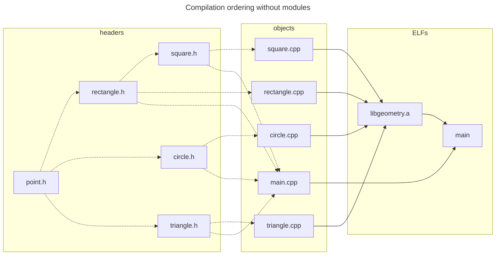
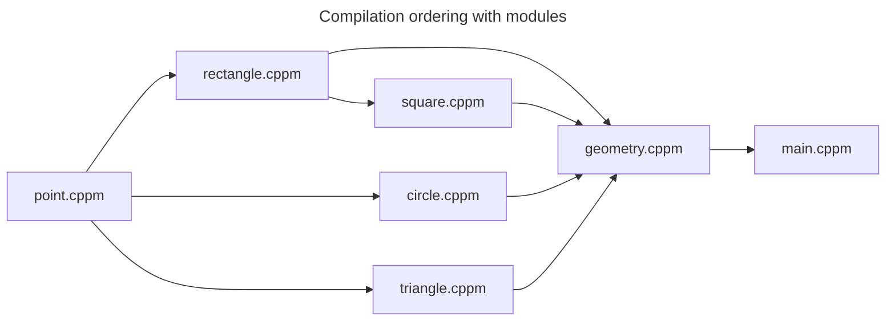
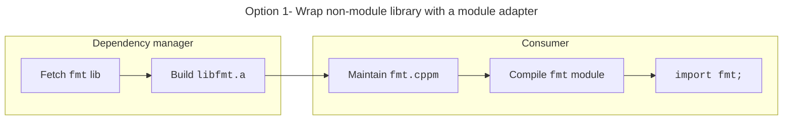
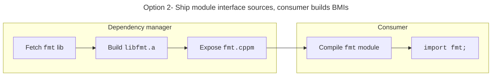
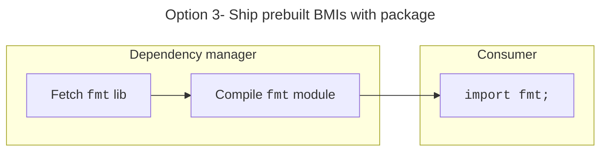

# Build Systems and Tooling

---
layout: statement
title: Compilation ordering without modules
---



<!-- ### Notes:
- This is what is called an "embarassingly parallel" build.
-->

---
layout: statement
title: Compilation ordering with modules
---



---
layout: default
info: |
    https://cmake.org/cmake/help/latest/manual/cmake-cxxmodules.7.html
    
---

## Dependency scanning

<div class="grid grid-cols-2 gap-x-4 items-center">

<div>
Things are more complicated:

```cpp [square.cppm ~i-vscode-icons:file-type-cpp2~]{*|none|1|3}{at: 2}
export module square;

export import rectangle;
```
</div>

<div>
<v-click at=1>

We can "scan" the dependencies:

<!-- Format determined by [P1689R5](https://www.open-std.org/jtc1/sc22/wg21/docs/papers/2022/p1689r5.html) -->

```json [square.cppm.ddi ~i-vscode-icons:file-type-json~]{hide|*|2|3-6|7-9}{at: 1}
{
    "primary-output": "square.o",
    "provides": [{
        "compiled-module-path": "square.pcm",
        "logical-name": "square"
    }],
    "requires": [{
        "logical-name": "rectangle"
    }]
}
```

</v-click>
</div>

</div>

---
layout: default
---

## Modules support in CMake

[CMake 3.28](https://cmake.org/cmake/help/latest/manual/cmake-cxxmodules.7.html): Native support* for named modules (not header units)

<!-- Snippet from @/testing/cmake_modules/CMakeLists.txt -->
```cmake [CMakeLists.txt ~i-vscode-icons:file-type-cmake~]{*|1|3-5|7-11|13-14}
cmake_minimum_required(VERSION 3.28 FATAL_ERROR)

set(CMAKE_CXX_STANDARD 20)

project(ModulesExample CXX)

add_library(Lib)
target_sources(Lib
    PUBLIC FILE_SET modules TYPE CXX_MODULES FILES lib.cppm
    PRIVATE lib.impl.cpp
)

add_executable(Main main.cpp)
target_link_libraries(Main PRIVATE Lib)
```

\* Supported on the `Ninja` and `Visual Studio` generators

---
layout: default
---

## Modules support in CMake

```sh {*}{lines: false}
$ cmake .. -GNinja -DCMAKE_BUILD_TYPE=Release && ninja
```

```txt {*|1-3|4-5|6-8|9-10}{lines: false}
[1/10] Scanning lib.cppm for CXX dependencies
[2/10] Scanning main.cpp for CXX dependencies
[3/10] Scanning lib.impl.cpp for CXX dependencies
[4/10] Generating CXX dyndep file CMakeFiles/Lib.dir/CXX.dd
[5/10] Generating CXX dyndep file CMakeFiles/Main.dir/CXX.dd
[6/10] Building CXX object CMakeFiles/Lib.dir/lib.cppm.o
[7/10] Building CXX object CMakeFiles/Lib.dir/lib.impl.cpp.o
[8/10] Building CXX object CMakeFiles/Main.dir/main.cpp.o
[9/10] Linking CXX static library libLib.a
[10/10] Linking CXX executable Main
```

---
layout: default
---

## Modules support in CMake: STL module

[CMake 3.30](https://www.kitware.com/import-std-in-cmake-3-30/): Experimental support for `import std;`

<!-- Snippet from @/testing/cmake_import_std/CMakeLists.txt -->
```cmake [CMakeLists.txt ~i-vscode-icons:file-type-cmake~]{*|4-5|9}
cmake_minimum_required(VERSION 3.30 FATAL_ERROR)

set(CMAKE_CXX_STANDARD 23)
set(CMAKE_EXPERIMENTAL_CXX_IMPORT_STD "0e5b6991-d74f-4b3d-a41c-cf096e0b2508")
set(CMAKE_CXX_MODULE_STD ON)

project(ImportStd LANGUAGES CXX)

add_executable(main main.cpp)
```

---
layout: default
---

## Modules support in CMake: STL module

```sh {*}{lines: false}
$ cmake .. -GNinja -DCMAKE_BUILD_TYPE=Release && ninja
```

```txt {*|1-2,4,6-8|3,5,9-10}{lines: false}
[1/10] Scanning std.compat.ixx for CXX dependencies
[2/10] Scanning std.ixx for CXX dependencies
[3/10] Scanning main.cpp for CXX dependencies
[4/10] Generating CXX dyndep file CMakeFiles\__cmake_cxx23.dir\CXX.dd
[5/10] Generating CXX dyndep file CMakeFiles\main.dir\CXX.dd
[6/10] Building CXX object std.ixx.obj
[7/10] Building CXX object std.compat.ixx.obj
[8/10] Linking CXX static library __cmake_cxx23.lib
[9/10] Building CXX object CMakeFiles\main.dir\main.cpp.obj
[10/10] Linking CXX executable main.exe
```

---
layout: default
---

## Modules support in Bazel

* [Experimental community rules](https://github.com/igormcoelho/rules_cpp23_modules) for modules

````md magic-move[BUILD ~i-vscode-icons:file-type-bazel~]

```py{*|1|3-8|5-6|10-16|12|13|*}
load("@rules_cpp23_modules//cc_module:defs.bzl", "cc_module", "cc_module_binary", "cc_compiled_module")

cc_module(
    name = "lib",
    src = "lib.cppm",
    impl_srcs = ["lib.impl.cpp",],
    copts = ["-std=c++23", "-stdlib=libc++"],
)

cc_module_binary(
    name = "main",
    srcs = ["main.cpp",],
    deps = [":lib"],
    copts = ["-std=c++23"],
    linkopts = ["-stdlib=libc++"],
)
```

<!-- Snippet from @/testing/bazel_modules/BUILD -->
```py{*|3|9-10,16-17|*}
load("@rules_cpp23_modules//cc_module:defs.bzl", "cc_module", "cc_module_binary", "cc_compiled_module")

cc_compiled_module(name="std", cmi="std.pcm")

cc_module(
    name = "lib",
    src = "lib.cppm",
    impl_srcs = ["lib.impl.cpp",],
    deps = [":std"],
    copts = ["-fmodule-file=std=std.pcm", "-std=c++23", "-stdlib=libc++"],
)

cc_module_binary(
    name = "main",
    srcs = ["main.cpp",],
    deps = [":lib", ":std"],
    copts = ["-fmodule-file=std=std.pcm", "-std=c++23"],
    linkopts = ["-stdlib=libc++"],
)
```

````

<!-- ### Notes:
- The `rules_cpp23_modules` package comes from [Igor Machado Coelho's experiments](https://igormcoelho.medium.com/experimenting-c-23-import-std-with-bazel-and-clang-1bec82779ac8)
- Bazel has two PRs ([#22553](https://github.com/bazelbuild/bazel/pull/22553), [#22555](https://github.com/bazelbuild/bazel/pull/22555))
that are open since May 2024 for supporting modules natively on Bazel.
-->
    
---
layout: default
---

## Modules support in Build2

<br>

<!-- Snippet from @/testing/build2_modules/buildfile -->
```txt [buildfile ~i-vscode-icons:default-file~]{*|2|6|6|7|*}
cxx.std = latest
cxx.features.modules=true

using cxx

./: libue{lib}: mxx{lib.cppm} cxx{lib.impl.cpp}
./: exe{main}: cxx{main.cpp} libue{lib}
```

<v-click at=2>

Glossary:

* `libue{x}`: utility library for an executable called `x`

</v-click>

<v-click at=3>

* `mxx{x.cppm}`: module source `x.cppm`
* `cxx{x.cppm}`: C++ source `x.cppm`

</v-click>

<v-click at=4>

* `exe{x}`: executable called `x`

</v-click>

---
layout: default
---

## Dependency managers

Dependency managers perform:

- Automated retrieval
- Transitive dependency handling
- <span v-mark.red=1>Cross-platform consistency</span>
- <span v-mark.red=1>Build integration</span>
- <span v-mark.red=1>Binary caching</span>

<!-- ### Notes:
- Automated retrieval: Fetch and integrate libraries from remote repositories.
- Transitive dependency handling: Automatically pull in dependencies of dependencies.
- Cross-platform consistency: Get the same set of libraries working across different operating systems / build systems.
- Build integration: Many tools hook directly into build systems, reducing boilerplate.
- Binary caching: Speed up builds by reusing prebuilt binaries when possible.
-->

---
layout: statement
title: Option 1- Wrap non-module library with a module adapter
---



---
layout: statement
title: Sample code for fmt module adapter
---

<div class="text-left">

<!-- Snippet from @/testing/conan_fmt_module_wrapper/fmt.cppm -->
```cpp [fmt.cppm ~i-vscode-icons:file-type-cpp2~]{*|1-3|7-13}
module;

#include <fmt/core.h>

export module fmt;

export namespace fmt
{
    using ::fmt::print;
    using ::fmt::println;
    using ::fmt::format;
    // ...
}
```

</div>

---
layout: statement
title: Option 2- Ship module interface sources, consumer builds BMIs
---



---
layout: statement
title: Option 3- Ship prebuilt BMIs with package
---



---
layout: default
---

## Dependency managers

The process can easily become:

- Platform-specific
- Difficult to maintain
- Error-prone

---
layout: default
title: Dependency managers
preload: false # fixes overview pre-rendering
---

<br><br>

<DependencyManagersFrustrationOutcome/>
